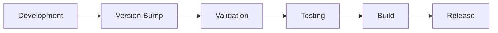

# Version Management Guide

This document explains how version management works in the arris-modem-status library and how to properly maintain semantic versioning.

## Overview

The arris-modem-status library uses **centralized version management** with a single source of truth approach:

- **Single Source**: `arris_modem_status/__init__.py` contains `__version__ = "1.3.0"`
- **Dynamic Reading**: `pyproject.toml` reads version dynamically from the package
- **Automated Tools**: Scripts and Makefile commands handle version operations
- **Validation**: CI/CD ensures version consistency across all files

## Version Management System

### Single Source of Truth

The version is defined **only once** in `arris_modem_status/__init__.py`:

```python
# SINGLE SOURCE OF TRUTH FOR VERSION
__version__ = "1.3.0"
```

All other files read from this single source:

- `pyproject.toml` uses dynamic version: `dynamic = ["version"]`
- Scripts read from the import: `from arris_modem_status import __version__`
- Documentation references this version automatically

### Semantic Versioning (SemVer)

We follow [Semantic Versioning 2.0.0](https://semver.org/):

- **MAJOR.MINOR.PATCH** (e.g., `1.3.0`)
- **MAJOR**: Incompatible API changes
- **MINOR**: Backward-compatible functionality additions
- **PATCH**: Backward-compatible bug fixes

## Using the Version Management Tools

### Command Line Interface

The `scripts/manage_version.py` script provides all version operations:

```bash
# Show current version
python scripts/manage_version.py --current

# Show detailed version information
python scripts/manage_version.py --info

# Bump versions
python scripts/manage_version.py --bump patch    # 1.3.0 -> 1.3.1
python scripts/manage_version.py --bump minor    # 1.3.0 -> 1.4.0
python scripts/manage_version.py --bump major    # 1.3.0 -> 2.0.0

# Set specific version
python scripts/manage_version.py --set 1.3.1

# Validate version consistency
python scripts/manage_version.py --validate

# Clean up whitespace issues
python scripts/manage_version.py --clean
```

### Makefile Commands

Convenient Makefile targets for common operations:

```bash
# Version operations
make version                    # Show current version
make version-info              # Show detailed information
make version-bump-patch        # Bump patch version
make version-bump-minor        # Bump minor version
make version-bump-major        # Bump major version
make version-set VERSION=1.3.1 # Set specific version

# Quality operations
make validate                  # Validate consistency
make clean-whitespace         # Fix whitespace issues
make format                   # Format code
make lint                     # Run linting
```

### Programmatic Access

Access version information in Python code:

```python
# Basic version access
from arris_modem_status import __version__
print(f"Version: {__version__}")

# Advanced version utilities
from arris_modem_status._version import (
    get_version,
    get_version_info,
    get_full_version_info,
    format_version_string
)

# Get version as string
version = get_version()  # "1.3.0"

# Get version as tuple
version_info = get_version_info()  # (1, 3, 0)

# Get comprehensive information
full_info = get_full_version_info()
print(full_info['version'])        # "1.3.0"
print(full_info['python_version']) # "3.11.5"

# Format for display
display_string = format_version_string(include_metadata=True)
# "arris-modem-status v1.3.0 by Charles Marshall (MIT License)"
```

## Development Workflow

### Making Changes with Version Bumps

1. **Make your changes**
2. **Determine version bump type**:
   - **Patch**: Bug fixes, documentation updates, internal improvements
   - **Minor**: New features, new CLI options, backward-compatible changes
   - **Major**: Breaking changes, API modifications, removed features

3. **Bump the version**:
   ```bash
   make version-bump-patch  # Most common
   # or
   make version-bump-minor  # For new features
   # or  
   make version-bump-major  # For breaking changes
   ```

4. **Validate everything**:
   ```bash
   make validate           # Check version consistency
   make dev-check         # Run format, lint, test
   ```

5. **Commit with descriptive message**:
   ```bash
   git add .
   git commit -m "feat: add performance instrumentation (bump minor to 1.4.0)"
   ```

### Pre-Release Checklist

Before releasing a new version:

```bash
# 1. Validate everything
make validate
make dev-check

# 2. Run comprehensive tests
make test
make test-integration PASSWORD="your_password"

# 3. Check build system
make build
make build-check

# 4. Test release (optional)
make release-test  # Uploads to TestPyPI
```

## Version Consistency Validation

### Automatic Checks

The system automatically validates:

- ✅ Version format follows SemVer (e.g., `1.3.0`)
- ✅ All files reference the same version
- ✅ Documentation mentions current version
- ✅ No hardcoded versions in other files
- ✅ PEP 8 whitespace compliance
- ✅ Build system dynamic configuration

### Manual Validation

Run validation anytime:

```bash
# Quick validation
make validate

# Comprehensive setup check
python scripts/validate_setup.py

# Check specific aspects
python scripts/manage_version.py --validate
python scripts/manage_version.py --clean
```

## CI/CD Integration

### GitHub Actions

The `.github/workflows/quality-check.yml` workflow automatically:

- ✅ Validates version consistency on every push
- ✅ Checks whitespace compliance (PEP 8)
- ✅ Verifies no hardcoded versions exist
- ✅ Warns if PR doesn't bump version
- ✅ Tests build system and distribution

### Pre-commit Hooks

The `.pre-commit-config.yaml` file automatically:

- ✅ Removes trailing whitespace
- ✅ Fixes end-of-file issues  
- ✅ Validates YAML, JSON, TOML files
- ✅ Formats code with Black
- ✅ Sorts imports with isort
- ✅ Runs linting with flake8

Install pre-commit hooks:

```bash
pip install pre-commit
pre-commit install
```

## Common Scenarios

### Scenario 1: Bug Fix Release

```bash
# Fix the bug in your code
# Then bump patch version
make version-bump-patch
# Result: 1.3.0 -> 1.3.1
```

### Scenario 2: New Feature Release

```bash
# Add new features
# Then bump minor version  
make version-bump-minor
# Result: 1.3.0 -> 1.4.0
```

### Scenario 3: Breaking Change Release

```bash
# Make breaking changes
# Then bump major version
make version-bump-major
# Result: 1.3.0 -> 2.0.0
```

### Scenario 4: Hot Fix

```bash
# For urgent fixes, you might want a specific version
make version-set VERSION=1.3.2
# Then test and release immediately
```

### Scenario 5: Development Version

```bash
# For development, you might use pre-release versions
make version-set VERSION=1.4.0-dev
# Note: This is not recommended for main branch
```

## Troubleshooting

### Common Issues

**Issue**: "Version not found in __init__.py"
```bash
# Solution: Check that __version__ is properly defined
grep "__version__" arris_modem_status/__init__.py
```

**Issue**: "Version consistency issues found"
```bash
# Solution: Run validation and fix reported issues
make validate
python scripts/manage_version.py --validate
```

**Issue**: "Whitespace issues found"
```bash
# Solution: Clean up whitespace automatically
make clean-whitespace
```

**Issue**: "Build system not configured correctly"
```bash
# Solution: Check pyproject.toml dynamic configuration
python scripts/validate_setup.py
```

### Emergency Fixes

If the version system is broken:

1. **Check the source**:
   ```bash
   cat arris_modem_status/__init__.py | grep __version__
   ```

2. **Manually fix if needed**:
   ```python
   # In arris_modem_status/__init__.py
   __version__ = "1.3.0"  # Ensure this line exists and is correct
   ```

3. **Re-validate**:
   ```bash
   python scripts/validate_setup.py
   ```

## Best Practices

### Do's ✅

- ✅ Always use the provided scripts and Makefile commands
- ✅ Bump version for every significant change
- ✅ Validate before committing: `make dev-check`
- ✅ Use semantic versioning rules consistently
- ✅ Test build system before releasing: `make build`
- ✅ Keep CHANGELOG.md updated with version changes

### Don'ts ❌

- ❌ Never edit version in multiple places
- ❌ Don't hardcode versions in documentation
- ❌ Avoid manual version editing (use scripts)
- ❌ Don't skip validation checks
- ❌ Never commit with trailing whitespace
- ❌ Don't release without bumping version

## Integration with Release Process

### Development to Release Flow



1. **Development**: Make your changes
2. **Version Bump**: `make version-bump-{patch|minor|major}`
3. **Validation**: `make validate && make dev-check`
4. **Testing**: `make test && make test-integration`
5. **Build**: `make build && make build-check`
6. **Release**: `make release` (or `make release-test` first)

### Automated Release

For automated releases, the version management integrates with:

- **GitHub Actions**: Auto-build on version tags
- **PyPI Publishing**: Auto-publish on version bumps
- **Documentation**: Auto-update docs with new versions
- **Changelog**: Auto-update with version information

This ensures that version management is seamlessly integrated into your entire development and release pipeline.